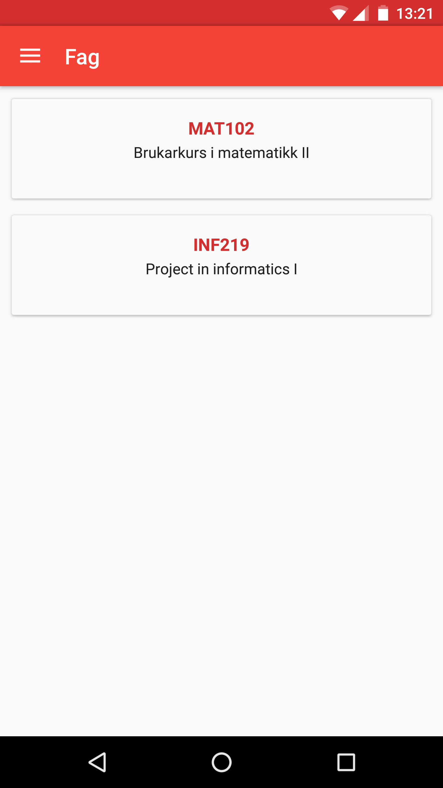
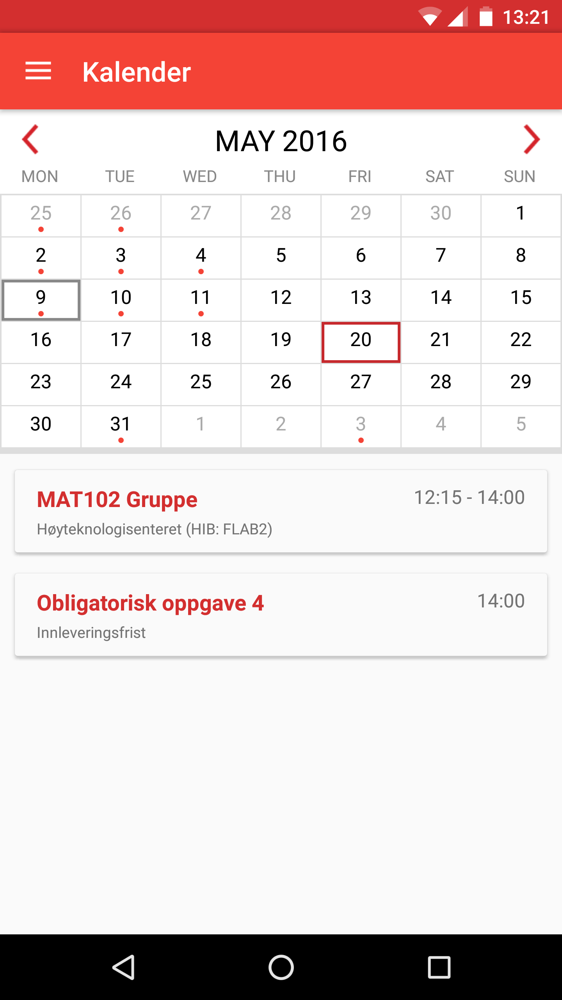
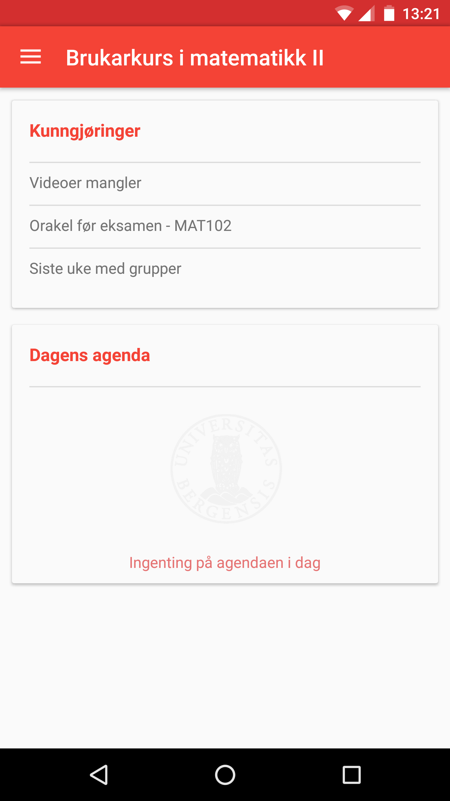
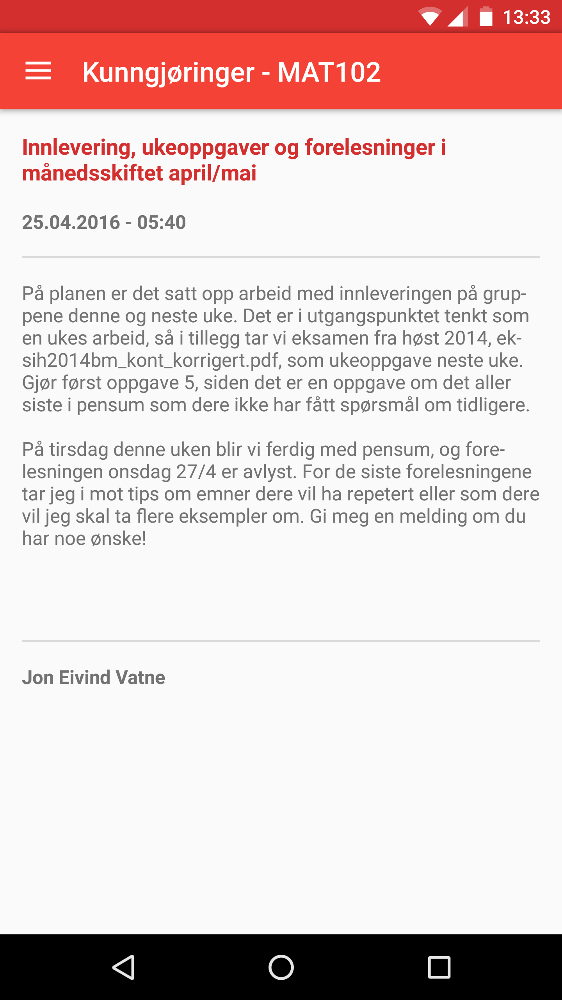
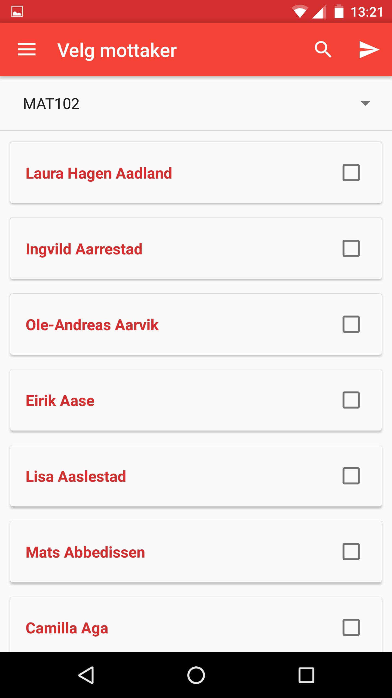

# Mitt UiB Android app
This application was programmed as part of the course <i>INF219: Project in informatics 1</i> at University of Bergen, spring 2016.

At the time of the project, no native Android application existed for the information system, <i>Mitt UiB</i>, used at University of Bergen, so the project was suitable for the INF219 course.

Mitt UiB uses the open REST API [<i>Canvas LMS</i>](https://canvas.instructure.com/doc/api/index.html).

## Previews

## Authors
The project is managed by Patrick Halmøy Finseth, Øystein Follo and Andre Mossige.

## License
This project is licensed under the GNU General Public License v3.0 - see the [LICENSE.md](LICENSE.md) file for details.
